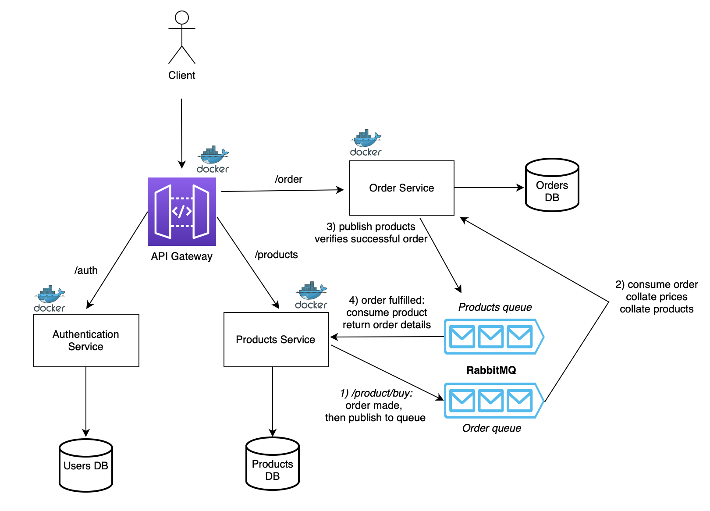

# proactive-autoscaler-for-kubernetes-local-test-setup

A scalable, microservices-based e-commerce application built with Node.js, Express, MongoDB, and RabbitMQ. This project demonstrates a modern event-driven architecture deployable on Kubernetes.

## 🏗️ Architecture



The application consists of the following microservices:
- **API Gateway**: Entry point for all client requests. routes traffic to appropriate services.
- **Auth Service**: Manages user authentication and JWT generation.
- **Product Service**: Manages product catalog and inventory.
- **Order Service**: Handles order creation and processing.
- **RabbitMQ**: Asynchronous message broker for inter-service communication (e.g., Order creation -> Inventory update).
- **MongoDB**: Dedicated database instances for each service.

---

## 🚀 Getting Started

### Prerequisites
Ensure you have the following installed:
- [Node.js](https://nodejs.org/) (v16+)
- [Docker & Docker Compose](https://www.docker.com/products/docker-desktop)
- [Kubectl](https://kubernetes.io/docs/tasks/tools/)
- [Kind](https://kind.sigs.k8s.io/docs/user/quick-start/) (For local Kubernetes cluster)

### 1. Repository Setup
Clone the repository:
```bash
git clone https://github.com/Praveen1214/nodejs-ecommerce-microservice.git
cd nodejs-ecommerce-microservice
```

---

## 💻 Running Locally (Docker Compose)
The easiest way to stand up the environment for development.

1. **Setup Environment Variables**:
   Create `.env` files for `auth`, `product`, and `order` keys (see `env.example` or below).

2. **Start Services**:
   ```bash
   docker-compose up --build
   ```
   The API Gateway will be available at `http://localhost:3003`.

3. **Stop Services**:
   ```bash
   docker-compose down
   ```

---

## ☸️ Running on Local Kubernetes Cluster
Follow these steps to set up a local Kubernetes cluster using **Kind**.

### 1. Create Cluster
We have provided a Kind configuration.
```bash
kind create cluster --config k8s/kind-config.yaml --name ecommerce-cluster
```

### 2. Deploy Infrastructure
Create the necessary specific namespaces:
```bash
# Create Test Namespace
kubectl apply -f k8s/base/namespace-test.yaml
```

### 3. Deploy Application (Test Environment)
Deploy all microservices and databases to the cluster:
```bash
kubectl apply -f k8s/test/
```

### 4. Verify Pods
Wait until all pods are in `Running` state:
```bash
kubectl get pods -n ecommerce-test -w
```
*(Press `Ctrl+C` to exit watch mode when all are ready)*

### 5. Access the Application
Since we are using a local cluster, use `port-forward` to access the API Gateway:
```bash
kubectl port-forward svc/api-gateway 3003:80 -n ecommerce-test
```
Now access the API at **http://localhost:3003**.

---

## 🤝 How to Contribute

We welcome contributions! Please follow these steps to contribute to the project:

### 1. Fork the Project
Click the **Fork** button at the top right of the repository page to create your own copy.

### 2. Create a Feature Branch
Clone your fork and create a new branch for your feature or fix:
```bash
git checkout -b feature/amazing-feature
```

### 3. Make Changes
- Write clean, maintainable code.
- Ensure you adhere to the existing code style.
- Add comments where necessary.

### 4. Commit Changes
Commit your changes with a descriptive message:
```bash
git commit -m "feat: Add amazing feature to product service"
```

### 5. Push to Branch
Push your changes to your forked repository:
```bash
git push origin feature/amazing-feature
```

### 6. Open a Pull Request
Go to the original repository and open a Pull Request (PR) from your fork. Provide a clear description of what your changes do.

---

## 🔍 Monitoring & Observability
This project uses the **Kube Prometheus Stack**.

### Setup
```bash
helm repo add prometheus-community https://prometheus-community.github.io/helm-charts
helm repo update
kubectl create namespace monitoring
helm install prometheus prometheus-community/kube-prometheus-stack --namespace monitoring
```

### Access Grafana
```bash
kubectl port-forward svc/prometheus-grafana 3000:80 -n monitoring
# Access at http://localhost:3000 (User: admin)
```
Get admin password:
```bash
kubectl get secret --namespace monitoring prometheus-grafana -o jsonpath="{.data.admin-password}" | base64 --decode
```

---

## 📂 Project Structure
```
├── api-gateway/       # API Gateway Service
├── auth/              # Authentication Service
├── product/           # Product Service
├── order/             # Order Service
├── k8s/               # Kubernetes Manifests
│   ├── base/          # Namespaces
│   ├── test/          # Test Environment Manifests
│   └── kind-config.yaml # Local Cluster Config
├── terraform/         # IaC
├── docker-compose.yml # Docker Compose Config
└── README.md          # Project Documentation
```
